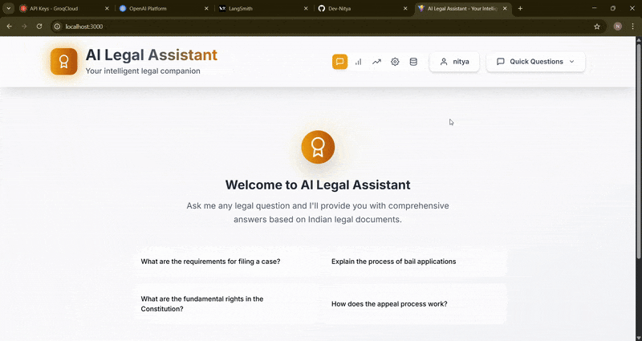
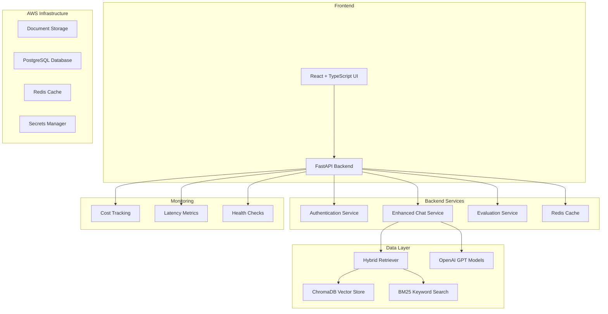

# AI Legal Assistant 🤖⚖️

> An intelligent legal document analysis and Q&A system powered by RAG (Retrieval-Augmented Generation) technology

[](https://fastapi.tiangolo.com)
[](https://reactjs.org/)
[](https://langchain.com)
[](https://openai.com/)

## 📋 Table of Contents

- [Overview](#overview)
- [Features](#features)
- [Architecture](#architecture)
- [Technology Stack](#technology-stack)
- [Quick Start](#quick-start)
- [Installation](#installation)
- [Configuration](#configuration)
- [Usage](#usage)
- [API Documentation](#api-documentation)
- [Deployment](#deployment)
- [Monitoring & Analytics](#monitoring--analytics)
- [Contributing](#contributing)
- [License](#license)

## 🎯 Overview

The AI Legal Assistant is a comprehensive solution that combines advanced natural language processing with legal document analysis capabilities. It leverages hybrid retrieval methods (semantic + keyword search) to provide accurate, contextual answers to legal questions while maintaining transparency through source attribution.

### Demo



### Key Capabilities

- **Document Analysis**: Upload and analyze legal documents (PDFs, text files)
- **Intelligent Q&A**: Ask complex legal questions and get contextual answers
- **Hybrid Search**: Combines semantic vector search with keyword-based retrieval
- **Source Attribution**: Every answer includes citations to source documents
- **Real-time Streaming**: Responses stream in real-time for better UX
- **Cost Monitoring**: Track OpenAI API usage and costs
- **Performance Analytics**: Monitor response times and system performance

## ✨ Features

### 🔍 Advanced Retrieval System

- **Hybrid Search**: Ensemble retriever combining BM25 and semantic search
- **Smart Reranking**: Advanced document scoring for relevance
- **Query Preprocessing**: Automatic query enhancement and expansion
- **Metadata Filtering**: Filter documents by type, date, or custom attributes

### 🔐 Enterprise-Ready Security

- **Authentication System**: JWT-based user authentication
- **Rate Limiting**: Configurable API rate limits with Redis backing
- **Input Validation**: Comprehensive request validation and sanitization
- **AWS Integration**: Secure secrets management with AWS Secrets Manager

### 📊 Monitoring & Analytics

- **Cost Tracking**: Real-time OpenAI API usage and cost monitoring
- **Latency Metrics**: Detailed performance tracking with TTFT (Time to First Token)
- **Evaluation Framework**: Built-in RAG evaluation with multiple metrics
- **Health Monitoring**: Comprehensive health checks and logging

### 🚀 Scalable Architecture

- **FastAPI Backend**: High-performance async Python API
- **React Frontend**: Modern, responsive user interface
- **Vector Database**: ChromaDB for efficient similarity search
- **Caching Layer**: Redis for performance optimization
- **AWS Deployment**: CloudFormation templates for production deployment

## 🏗️ Architecture



## 🛠️ Technology Stack

### Backend

- **FastAPI** - Modern, fast web framework for building APIs
- **LangChain** - Framework for developing LLM applications
- **OpenAI API** - GPT models for natural language processing
- **ChromaDB** - Vector database for semantic search
- **Redis** - In-memory data structure store for caching
- **PostgreSQL** - Production database (AWS RDS)
- **SQLite** - Development database

### Frontend

- **React 19** - User interface library
- **TypeScript** - Typed JavaScript for better development
- **Vite** - Fast build tool and development server
- **TailwindCSS** - Utility-first CSS framework
- **React Query** - Data fetching and state management
- **Framer Motion** - Animation library

### Infrastructure

- **Docker** - Containerization
- **AWS CloudFormation** - Infrastructure as Code
- **AWS ECS** - Container orchestration
- **AWS S3** - Document storage
- **AWS RDS** - Managed PostgreSQL database
- **AWS ElastiCache** - Managed Redis cache

### AI/ML Stack

- **OpenAI GPT-4** - Large language model for generation
- **sentence-transformers** - Embedding models for semantic search
- **scikit-learn** - Machine learning utilities
- **BM25** - Keyword-based retrieval algorithm

## 🚀 Quick Start

### Using Docker Compose (Recommended)

1. **Clone the repository**

   ```bash
   git clone https://github.com/your-username/ai-legal-assistant.git
   cd ai-legal-assistant
   ```

2. **Set up environment variables**

   ```bash
   cp .env.example .env
   # Edit .env with your OpenAI API key and other configurations
   ```

3. **Run with Docker Compose**

   ```bash
   cd backend
   docker-compose up -d
   ```

4. **Access the application**
   - API Documentation: http://localhost:8000/docs
   - Frontend: http://localhost:3000 (if configured)

## 💻 Installation

### Prerequisites

- Python 3.11+
- Node.js 18+
- Redis (for caching)
- PostgreSQL (for production)

### Backend Setup

1. **Create Python virtual environment**

   ```bash
   cd backend
   python -m venv .venv
   source .venv/bin/activate  # On Windows: .venv\Scripts\activate
   ```

2. **Install dependencies**

   ```bash
   pip install -r requirements.txt
   ```

3. **Set up environment variables**

   ```bash
   cp .env.example .env
   ```

   Edit `.env` with your configuration:

   ```env
   # Required
   OPENAI_API_KEY=your_openai_api_key_here

   # Optional - Database
   DATABASE_URL=sqlite:///./ai_legal_assistant.db

   # Optional - Redis
   REDIS_URL=redis://localhost:6379

   # Optional - AWS (for production)
   AWS_ACCESS_KEY_ID=your_aws_access_key
   AWS_SECRET_ACCESS_KEY=your_aws_secret_key
   AWS_REGION=us-east-1
   AWS_S3_BUCKET=your-documents-bucket
   ```

4. **Run the backend**
   ```bash
   uvicorn main:app --reload --host 0.0.0.0 --port 8000
   ```

### Frontend Setup

1. **Install dependencies**

   ```bash
   cd frontend
   npm install
   ```

2. **Start development server**

   ```bash
   npm run dev
   ```

3. **Build for production**
   ```bash
   npm run build
   ```

## ⚙️ Configuration

### Environment Variables

| Variable            | Description                   | Default                  | Required |
| ------------------- | ----------------------------- | ------------------------ | -------- |
| `OPENAI_API_KEY`    | OpenAI API key for GPT models | -                        | ✅       |
| `ENVIRONMENT`       | Deployment environment        | `development`            | ❌       |
| `DATABASE_URL`      | Database connection string    | SQLite local             | ❌       |
| `REDIS_URL`         | Redis connection string       | `redis://localhost:6379` | ❌       |
| `AWS_REGION`        | AWS region for services       | `us-east-1`              | ❌       |
| `LANGSMITH_API_KEY` | LangSmith tracing API key     | -                        | ❌       |

### Advanced Configuration

#### Rate Limiting

Configure in `backend/config/rate_limits.py`:

```python
RATE_LIMITS = {
    "chat": "10/minute",
    "evaluation": "5/minute",
    "upload": "3/minute"
}
```

#### Cost Monitoring

Set spending limits in `backend/config/cost_limits.py`:

```python
COST_LIMITS = {
    "daily_limit": 100.0,  # USD
    "monthly_limit": 1000.0,  # USD
    "per_request_limit": 5.0  # USD
}
```

## 🎮 Usage

### Basic Q&A

```python
# Example API request
POST /chat/enhanced
{
    "message": "What are the key provisions of contract termination?",
    "user_id": "user123",
    "session_id": "session456",
    "stream": true
}
```

### Document Upload

```python
# Upload legal documents
POST /documents/upload
{
    "file": "contract.pdf",
    "metadata": {
        "type": "contract",
        "date": "2024-01-01",
        "category": "employment"
    }
}
```

### Evaluation

```python
# Run evaluation on test dataset
POST /evaluation/run
{
    "dataset_name": "legal_qa_test",
    "metrics": ["accuracy", "relevance", "completeness"]
}
```

## 📚 API Documentation

### Chat Endpoints

- `POST /chat/enhanced` - Enhanced chat with RAG
- `GET /chat/history/{session_id}` - Get chat history
- `DELETE /chat/sessions/{session_id}` - Clear session

### Document Management

- `POST /documents/upload` - Upload documents
- `GET /documents/` - List documents
- `DELETE /documents/{document_id}` - Delete document

### Evaluation & Analytics

- `POST /evaluation/run` - Run evaluation
- `GET /evaluation/results/{run_id}` - Get evaluation results
- `GET /metrics/latency` - Get latency metrics
- `GET /metrics/costs` - Get cost analytics

### Administration

- `GET /health` - Health check
- `POST /cache/clear` - Clear cache
- `GET /admin/stats` - System statistics

Full API documentation available at `/docs` when running the server.

## 🚀 Deployment

### AWS Production Deployment

1. **Deploy infrastructure**

   ```bash
   cd infrastructure
   aws cloudformation deploy \
     --template-file cloudformation.yml \
     --stack-name ai-legal-assistant \
     --parameter-overrides \
       Environment=production \
       DBPassword=YourSecurePassword123
   ```

2. **Build and deploy application**

   ```bash
   # Build Docker image
   docker build -t ai-legal-assistant .

   # Tag for ECR
   docker tag ai-legal-assistant:latest \
     123456789012.dkr.ecr.us-east-1.amazonaws.com/ai-legal-assistant:latest

   # Push to ECR
   docker push 123456789012.dkr.ecr.us-east-1.amazonaws.com/ai-legal-assistant:latest
   ```

### Docker Production Setup

1. **Production docker-compose.yml**

   ```yaml
   version: "3.8"
   services:
     app:
       image: ai-legal-assistant:latest
       environment:
         - ENVIRONMENT=production
         - DATABASE_URL=postgresql://user:pass@db:5432/legal_assistant
       depends_on:
         - db
         - redis

     db:
       image: postgres:15
       environment:
         POSTGRES_DB: legal_assistant
         POSTGRES_USER: user
         POSTGRES_PASSWORD: password

     redis:
       image: redis:7-alpine
   ```

### Environment-Specific Configurations

| Environment | Database       | Cache       | Storage     | Monitoring             |
| ----------- | -------------- | ----------- | ----------- | ---------------------- |
| Development | SQLite         | Local Redis | Local files | Basic logging          |
| Staging     | PostgreSQL     | ElastiCache | S3          | CloudWatch             |
| Production  | RDS PostgreSQL | ElastiCache | S3          | CloudWatch + LangSmith |

## 📊 Monitoring & Analytics

### Built-in Metrics

- **Response Time**: TTFT (Time to First Token) and total response time
- **Cost Tracking**: Real-time OpenAI API usage and costs
- **Error Rates**: Track and analyze system errors
- **Cache Performance**: Redis cache hit/miss ratios

### Evaluation Framework

The system includes a comprehensive evaluation framework:

```python
# Run evaluation
evaluator = RAGEvaluator(
    retriever=enhanced_retriever,
    llm=ChatOpenAI(),
    metrics=["accuracy", "relevance", "completeness", "groundedness"]
)

results = evaluator.evaluate(test_dataset)
```

### Available Metrics

- **Accuracy**: How often the answer is factually correct
- **Relevance**: How well the answer addresses the question
- **Completeness**: How comprehensive the answer is
- **Groundedness**: How well the answer is supported by sources
- **Latency**: Response time metrics

## 🤝 Contributing

We welcome contributions! Please see our [Contributing Guidelines](CONTRIBUTING.md) for details.

### Development Setup

1. Fork the repository
2. Create a feature branch: `git checkout -b feature/amazing-feature`
3. Make your changes
4. Run tests: `pytest backend/tests/`
5. Commit your changes: `git commit -m 'Add amazing feature'`
6. Push to the branch: `git push origin feature/amazing-feature`
7. Open a Pull Request

### Code Style

- Python: Follow PEP 8, use Black formatter
- TypeScript: Follow Airbnb style guide, use Prettier
- Commit messages: Follow Conventional Commits

## 🐛 Troubleshooting

### Common Issues

1. **OpenAI API Key Issues**

   ```bash
   # Verify API key is set
   echo $OPENAI_API_KEY

   # Test API connectivity
   curl -H "Authorization: Bearer $OPENAI_API_KEY" \
        https://api.openai.com/v1/models
   ```

2. **Vector Database Issues**

   ```bash
   # Clear ChromaDB if corrupted
   rm -rf backend/chroma_db/*

   # Rebuild vector database
   python backend/scripts/rebuild_vectordb.py
   ```

3. **Redis Connection Issues**

   ```bash
   # Check Redis status
   redis-cli ping

   # Clear Redis cache
   redis-cli FLUSHALL
   ```

### Performance Optimization

- Use Redis caching for frequently accessed documents
- Implement query result caching
- Optimize embedding model size based on accuracy needs
- Use async processing for document ingestion

## 📄 License

This project is licensed under the MIT License - see the [LICENSE](LICENSE) file for details.

## 🙏 Acknowledgments

- [LangChain](https://langchain.com) for the RAG framework
- [OpenAI](https://openai.com) for the GPT models
- [ChromaDB](https://www.trychroma.com/) for vector storage
- [FastAPI](https://fastapi.tiangolo.com/) for the web framework

## 📞 Support

For questions and support:

- 📧 Email: support@ai-legal-assistant.com
- 💬 Discord: [Join our community](https://discord.gg/ai-legal-assistant)
- 📖 Documentation: [docs.ai-legal-assistant.com](https://docs.ai-legal-assistant.com)
- 🐛 Issues: [GitHub Issues](https://github.com/your-username/ai-legal-assistant/issues)

---

⭐ If you find this project helpful, please consider giving it a star on GitHub!
